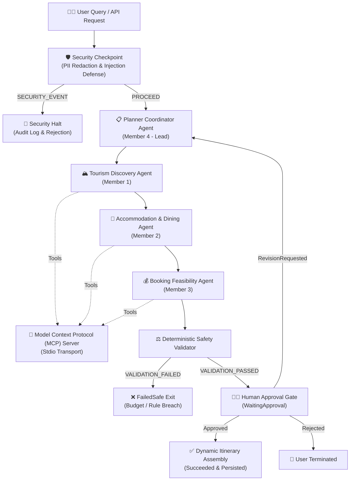

# 🏆 TourMate AI — Agentic Sri Lanka Tourism Concierge
## Competition Submission Write-Up & Technical Whitepaper

> **Track**: 🧑‍💼 Concierge Agents (Travel & Planning)  
> **Framework**: Google Agent Development Kit (ADK) 2.0  
> **Model**: Gemini 2.5 Flash (`gemini-2.5-flash`) via Google AI Studio  
> **Core Concepts**: ADK Multi-Agent Workflow, Specialized LlmAgents, AgentTool Delegation, Model Context Protocol (MCP) Server, Security Checkpoint & Guardrails, Human-In-The-Loop (HITL) Gate, Deterministic Safety Validation, and Persistent SQLite Storage.

---

## 1. Problem Statement

Sri Lanka is one of the world's premier travel destinations, featuring ancient UNESCO World Heritage fortresses, mountain cloud forests, tea plantations, and pristine coastlines. However, travelers and tourists face significant friction when planning itineraries:

1. **Information Fragmentation**: Sightseeing details, entry permits, cultural dress codes, and seasonal monsoon timings are scattered across disparate blogs and outdated websites.
2. **Hidden & Unpredictable Costs**: Local transport buffers (tuk-tuks, highland trains), seasonal price swings, and activity entry fees frequently lead to budget overruns.
3. **Hallucination Risks in Generic LLMs**: Standard generative chatbots fabricate nonexistent budget hotel rates, unfeasible travel schedules, or ignore strict financial constraints.
4. **Lack of Human Oversight in Automated Bookings**: Autonomous booking systems that commit financial transactions without human verification create financial and operational risks.

**TourMate AI** solves these challenges by deploying a specialized, multi-agent concierge system that combines generative LLM intelligence with deterministic mathematical constraints, live Model Context Protocol (MCP) tools, and mandatory human approval gates.

---

## 2. Solution Architecture

TourMate AI implements an ADK 2.0 graph workflow where specialist sub-agents coordinate through shared state and deterministic validators:

### Visual Assets
- **Cover Page Banner**: [`assets/cover_page_banner.png`](file:///c:/Users/akmal/Desktop/3.1/Software%20Engineering%20Framework/project/AI%20Agent/tourmate-ai/assets/cover_page_banner.png)
- **Architecture Workflow Diagram**: [`assets/architecture_diagram.png`](file:///c:/Users/akmal/Desktop/3.1/Software%20Engineering%20Framework/project/AI%20Agent/tourmate-ai/assets/architecture_diagram.png)

---

## 3. ADK & Agentic Concepts Used

| Concept | Implementation in TourMate AI | File Reference |
|---|---|---|
| **ADK 2.0 Workflow** | Graph-based workflow connecting nodes with directional edges; strictly adheres to the single-edge rule with deterministic routing. | [`app/agent.py`](file:///c:/Users/akmal/Desktop/3.1/Software%20Engineering%20Framework/project/AI%20Agent/tourmate-ai/app/agent.py) |
| **Specialized LlmAgents** | Three purpose-built sub-agents (`tourism_discovery_agent`, `accommodation_dining_agent`, `booking_feasibility_agent`) with tailored system instructions and domain tools. | [`app/agent.py`](file:///c:/Users/akmal/Desktop/3.1/Software%20Engineering%20Framework/project/AI%20Agent/tourmate-ai/app/agent.py#L38-L82) |
| **AgentTool Delegation** | Root agent coordinates and delegates reasoning tasks to sub-agents via `AgentTool(agent=...)` wrappers. | [`app/agent.py`](file:///c:/Users/akmal/Desktop/3.1/Software%20Engineering%20Framework/project/AI%20Agent/tourmate-ai/app/agent.py#L370-L390) |
| **Model Context Protocol (MCP)** | Standalone MCP Server over stdio transport exposing 5 tools for attractions, hotels, budget feasibility, weather, and cultural insights. | [`app/mcp_server.py`](file:///c:/Users/akmal/Desktop/3.1/Software%20Engineering%20Framework/project/AI%20Agent/tourmate-ai/app/mcp_server.py) |
| **Security Checkpoint & Guardrails** | Automated PII redaction (passports, credit cards, SL NICs), prompt injection detection, and structured JSON audit logging. | [`app/security.py`](file:///c:/Users/akmal/Desktop/3.1/Software%20Engineering%20Framework/project/AI%20Agent/tourmate-ai/app/security.py) |
| **State Persistence** | SQLite database layer saving workflow execution history, serialized state JSON, and tamper-evident audit logs. | [`app/database.py`](file:///c:/Users/akmal/Desktop/3.1/Software%20Engineering%20Framework/project/AI%20Agent/tourmate-ai/app/database.py) |
| **Human-In-The-Loop (HITL)** | State pauses at `WaitingApproval` using `request_input` before committing reservations; resumes via `/api/v1/ai/resume`. | [`app/fast_api_app.py`](file:///c:/Users/akmal/Desktop/3.1/Software%20Engineering%20Framework/project/AI%20Agent/tourmate-ai/app/fast_api_app.py#L135-L195) |
| **Agents CLI Integration** | Full scaffolding with `agents-cli`, pinned `pyproject.toml`, unified `Makefile`, and ADK Web Playground support. | [`Makefile`](file:///c:/Users/akmal/Desktop/3.1/Software%20Engineering%20Framework/project/AI%20Agent/tourmate-ai/Makefile) |

---

## 4. Security & Guardrails Design

TourMate AI treats security as a core architectural constraint rather than an afterthought:

1. **PII Scrubbing**:
   - Sanitizes user input before LLM tokenization using compiled regex patterns.
   - Detects and masks: Passports (`[A-Z]{1,2}[0-9]{7,8}`), Credit Cards (`(?:\d{4}[ -]?){3}\d{4}`), Sri Lankan National Identity Cards (both 9-digit old format with V/X and 12-digit new format), Phone Numbers (`+947...`), and Email Addresses.
2. **Adversarial Prompt Injection Defense**:
   - Evaluates input for jailbreak signatures (e.g., `ignore previous instructions`, `system prompt override`, `jailbreak`, `drop table`).
   - If detected, execution halts immediately and routes to `SECURITY_EVENT`, preventing adversarial goal hijacking.
3. **Domain Policy Limits**:
   - Rejects unrealistic budget allocations (enforces range of LKR 5,000 to LKR 50,000,000).
   - Validates requested destinations against the authorized Sri Lanka tourism catalog.
4. **Structured JSON Audit Logging**:
   - Logs security decisions and policy violations with severity levels (`INFO`, `WARNING`, `CRITICAL`) to persistent SQLite storage (`tourmate_ai.db`).

---

## 5. Model Context Protocol (MCP) Server

The MCP server implemented in [`app/mcp_server.py`](file:///c:/Users/akmal/Desktop/3.1/Software%20Engineering%20Framework/project/AI%20Agent/tourmate-ai/app/mcp_server.py) conforms to the official Model Context Protocol specification:

1. `search_attractions(destination, category, max_entry_fee)`: Retrieves verified sights, visiting time windows, duration, and entrance costs.
2. `search_accommodations_and_dining(destination, venue_type, max_cost_lkr)`: Retrieves verified eco-lodges, hotels, and authentic Sri Lankan culinary eateries.
3. `calculate_budget_feasibility(hotel_cost, dining_cost, activities_cost, budget_limit_lkr, transport_buffer_lkr)`: Deterministically calculates costs and buffers to prevent hallucinated math.
4. `check_weather_and_seasonality(destination, travel_month)`: Returns regional monsoon advisories (Hill Country vs. Southern Coast) and packing guidance.
5. `get_destination_insights(destination)`: Returns cultural temple guidelines, emergency hotlines (Tourist Police 1912, 1990 Ambulance), and transit tips.

---

## 6. Human-In-The-Loop (HITL) Gate

Automated booking without user consent is unacceptable in travel planning. TourMate AI implements a two-stage HITL approval mechanism:

1. **Execution Pause**: Once the Deterministic Validator confirms that the proposed trip satisfies all constraints, the status changes to `WaitingApproval`. The high-impact action (e.g., reserving hotel rooms or guided trekking permits) is presented for human inspection.
2. **Tri-State Resume Point**:
   - `Approved`: Status becomes `Succeeded`, final itinerary is committed, and confirmation is logged.
   - `Rejected`: Workflow transitions to `Rejected`, halting any downstream reservations.
   - `RevisionRequested`: Incorporates human feedback notes, sets status to `Running`, and routes back to the Planner Coordinator for re-planning.

---

## 7. Demo Walkthrough & Test Results

The system is validated by automated unit tests (`tests/unit/test_tourmate.py` — 13 passing tests):

### Test Case 1: Flagship Scenic Itinerary (Ella)
- **Input**: "Plan a 2-day Ella trip for LKR 40,000 interested in hiking and tea estates."
- **Execution**: Clears security gate -> Discovery Agent finds 4 attractions (Nine Arch Bridge, Little Adam's Peak, Ella Rock, Ravana Falls) -> Accommodation Agent pairs Ella Gap Eco Resort & Cafe Chill -> Feasibility Agent calculates total cost of LKR 32,300 -> Pauses at `WaitingApproval` with LKR 7,700 surplus.

### Test Case 2: Heritage Multi-Destination (Kandy)
- **Input**: "Plan a 2-day Kandy heritage tour for LKR 50,000 interested in culture and botanical gardens."
- **Execution**: Discovery Agent selects the Temple of the Tooth & Peradeniya Botanical Gardens -> Stays within budget (LKR 33,500 total) -> Pauses at `WaitingApproval`.

### Test Case 3: Overbudget Deterministic Block (Safety Verification)
- **Input**: "Plan a 2-day Ella trip for LKR 15,000."
- **Execution**: Feasibility Agent calculates total cost (LKR 32,300) -> Deterministic Safety Validator flags budget breach (`total > ceiling`) -> Routes to `FailedSafe` and halts execution.

---

## 8. Value & Real-World Impact

- **Empowering Travelers**: Provides custom, culturally rich itineraries in seconds with transparent pricing and no hallucinated recommendations.
- **Supporting Local Vendors**: Recommends verified Sri Lankan guest houses, eco-resorts, and authentic dining spots.
- **Guaranteed Financial Safety**: The deterministic validation layer ensures tourists never encounter surprise expenses.
- **Enterprise Ready**: Full security auditing, SQLite persistence, and containerized deployment readiness.
