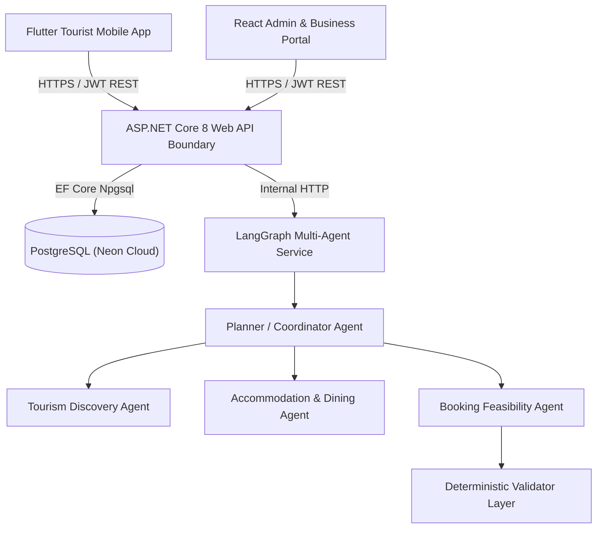

# TourMate - System Architecture Specification

## 1. Architectural Philosophy
The core architectural boundary of TourMate is strict and authoritative:
- Client applications (**React Web** and **Flutter Mobile**) communicate **only** with the **ASP.NET Core 8 Web API** via HTTPS and JWT Bearer tokens.
- Clients never communicate directly with PostgreSQL or the internal Python AI service.
- The **PostgreSQL Database** (targeted at Neon Cloud) serves as the relational system of record.
- The **Python LangGraph AI Service** is an internal orchestration gateway reachable only through backend mediation.

## 2. Component Layering
1. **Domain Layer (`TourMate.Domain`)**: Pure business models, status enums, value objects, and domain rules without external framework dependencies.
2. **Application Layer (`TourMate.Application`)**: Business logic orchestration, DTOs, CQRS/Services, and abstraction interfaces (`IUnitOfWork`, `IRepository`, `IAuthService`).
3. **Infrastructure Layer (`TourMate.Infrastructure`)**: EF Core DbContext, PostgreSQL Neon provider, BCrypt password hashing, JWT generator, database seeder, and AI HTTP client.
4. **Presentation Layer (`TourMate.Api`)**: Controllers, Swagger OpenAPI, JWT authentication middleware, and CORS configuration.
